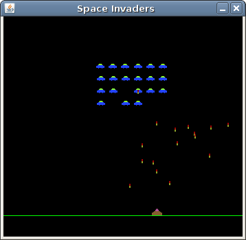

# Java Space Invaders

The Space Invaders Game is a Java-based implementation of the classic arcade shooter. Players control a spaceship at the bottom of the screen, firing at waves of descending aliens. The objective is to destroy all the aliens while avoiding their attacks and protecting the spaceship.

## Table of Contents

- [Features](#features)
- [Technologies Used](#technologies-used)
- [Source Code](#source-code)

## Features

- **Classic Gameplay**: Control a spaceship to shoot at waves of aliens.
- **Score Tracking**: Keeps track of the player's score.
- **Increasing Difficulty**: Aliens move faster and become more aggressive as the game progresses.
- **Power-Ups**: Collect power-ups to enhance the spaceship's abilities.

## Technologies Used

- **Java**: Core programming language used for the project.

## Source Code

- http://zetcode.com/javagames/spaceinvaders/

---
